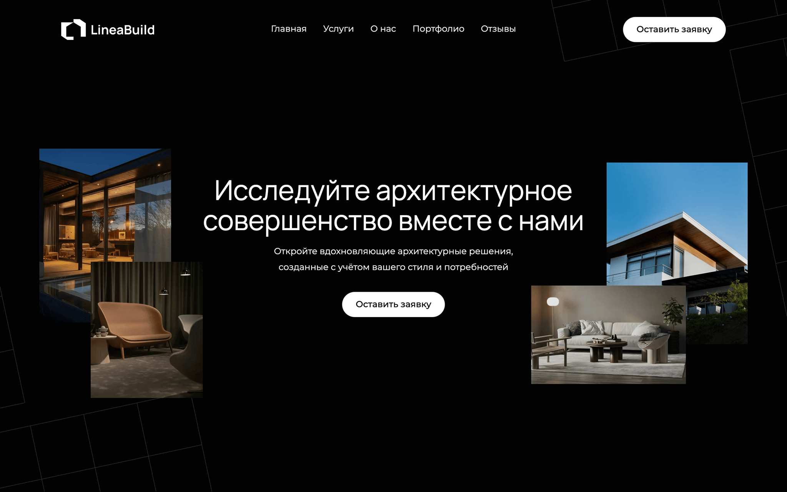
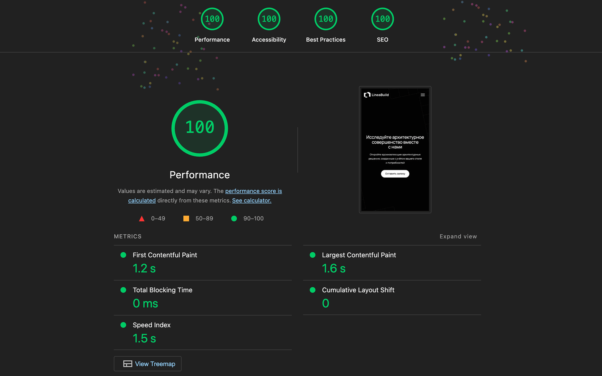

# Лендинг архитектурного бюро



## Особенности

- Кроссбраузерная и семантическая верстка
- Логические единицы для поддержки разных направлений письма
- UI-библиотека на основе веб-компонентов (Shoelace)
- Модульная архитектура проекта
- Автоматическая генерация SVG-спрайта
- Линтеры и автоформатирование кода

## Lighthouse результаты (100/100)



## Стек

HTML5, SCSS, TypeScript, БЭМ, Shoelace, GSAP, ESLint, Stylelint, Prettier, Vite

## Запуск в режиме разработки

```bash
npm install
npm run dev
```

## Сборка и предпросмотр проекта

```bash
npm run build
npm run preview
```

## Демо

https://pavelmalyv.github.io/linea-build/
